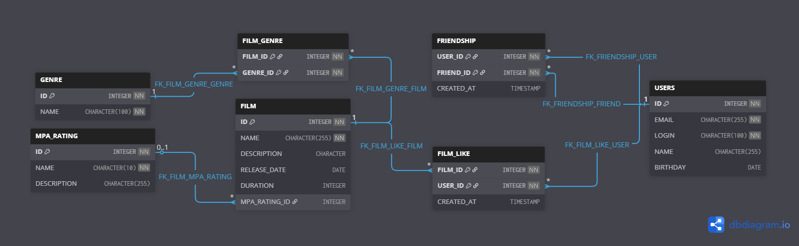

# Filmorate

Сервис для работы с фильмами и оценками пользователей. Позволяет составлять рейтинги, добавлять фильмы в избранное и
управлять списком друзей.

### Стек технологий

- **Java 11**
- **Spring Boot**
- **JDBC (JdbcTemplate)**
- **H2 Database** (встроенная, режимы: файловый / in-memory)
- **Maven**
- **Lombok**

### Схема БД


[ER-диаграмма Filmorate](https://dbdiagram.io/d/filmorate-69f9fd0f54a51d93d396d6fe)

### Пояснение к схеме

База данных разработана по принципам нормализации и обеспечивает хранение информации о пользователях, фильмах, жанрах,
рейтингах MPA, а также связях "дружба" и "лайк".

**Основные таблицы:**

* **`users`** — данные о пользователях сервиса (email, логин, имя, дата рождения).
* **`film`** — данные о фильмах, включая внешний ключ к рейтингу MPA.
* **`mpa_rating`** — справочник возрастных рейтингов MPAA (G, PG, PG-13, R, NC-17).
* **`genre`** — справочник жанров кино (Комедия, Драма, Мультфильм, Триллер, Документальный, Боевик).
* **`film_genre`** — связующая таблица для реализации отношения "многие ко многим" между фильмами и жанрами.
* **`friendship`** — таблица для хранения односторонних дружеских связей. Если пользователь A добавляет пользователя B в
  друзья, запись `(user_id = A, friend_id = B)` создаётся, но обратная запись не добавляется.
* **`film_like`** — таблица для хранения лайков, поставленных пользователями фильмам. Содержит временную метку
  `created_at`.

**Ключевые изменения относительно предыдущей версии:**

* Дружба стала односторонней — убрано поле `status`, подтверждение не требуется.
* Таблица пользователей переименована в `users` (соответствует стилю именования остальных таблиц).

### Примеры SQL-запросов для основных операций приложения

Представленные ниже запросы соответствуют реальной реализации в DAO-классах (`FilmDbStorage`, `UserDbStorage`,
`GenreDbStorage`, `MpaDbStorage`).

#### 1. CRUD-операции с фильмами и пользователями

* **Получение всех фильмов:**
  ```sql
  SELECT * FROM film;
  ``` 
* **Получение фильма по ID:**
  ```sql
  SELECT * FROM film WHERE id = ?;
  ```
* **Создание фильма:**
  ```sql
  INSERT INTO film (name, description, release_date, duration, mpa_rating_id)
  VALUES (?, ?, ?, ?, ?);
  ```
* **Обновление фильма:**
  ```sql
  UPDATE film
  SET name = ?, description = ?, release_date = ?, duration = ?, mpa_rating_id = ?
  WHERE id = ?;
  ```
* **Получение жанров фильма:**
  ```sql
  SELECT g.*
  FROM genre g
  JOIN film_genre fg ON fg.genre_id = g.id
  WHERE fg.film_id = ?;
  ```
* **Добавление жанра фильму:**
  ```sql
  INSERT INTO film_genre (film_id, genre_id) VALUES (?, ?);
  ```
* **Удаление всех жанров фильма (перед обновлением):**
  ```sql
  DELETE FROM film_genre WHERE film_id = ?;
  ```
* **Получение всех пользователей:**
  ```sql
  SELECT * FROM users;
  ```
* **Получение пользователя по ID:**
  ```sql
  SELECT * FROM users WHERE id = ?;
  ```
* **Создание пользователя:**
  ```sql
  INSERT INTO users (email, login, name, birthday) VALUES (?, ?, ?, ?);
  ```
* **Обновление пользователя:**
  ```sql
  UPDATE users SET email = ?, login = ?, name = ?, birthday = ? WHERE id = ?;
  ```
* **Проверка уникальности логина:**
  ```sql
  SELECT EXISTS(SELECT 1 FROM users WHERE login = ?);
  ```
* **Проверка уникальности email:**
  ```sql
  SELECT EXISTS(SELECT 1 FROM users WHERE email = ?);
  ```

#### 2. Справочники жанров и рейтингов

* **Получение всех жанров:**
  ```sql
  SELECT * FROM genre;
  ```
* **Получение жанра по ID:**
  ```sql
  SELECT * FROM genre WHERE id = ?;
  ```
* **Получение всех рейтингов MPA:**
  ```sql
  SELECT * FROM mpa_rating;
  ```
* **Получение рейтинга MPA по ID:**
  ```sql
  SELECT * FROM mpa_rating WHERE id = ?;
  ```

#### 3. Функционал "Лайки"

* **Функционал "Лайки"**
  ```sql
  INSERT INTO film_like (film_id, user_id, created_at) VALUES (?, ?, LOCALTIMESTAMP);
  ```
* **Удаление лайка:**
  ```sql
  DELETE FROM film_like WHERE film_id = ? AND user_id = ?;
  ```
* **Получение списка пользователей, поставивших лайк фильму:**
  ```sql
  SELECT user_id FROM film_like WHERE film_id = ?;
  ```
* **Получение топ-N популярных фильмов (по количеству лайков):**
  ```sql
  SELECT f.*
  FROM film f
  LEFT JOIN film_like fl ON f.id = fl.film_id
  GROUP BY f.id
  ORDER BY COUNT(fl.user_id) DESC
  LIMIT ?;
  ```

#### 4. Функционал "Друзья" (односторонняя дружба)

* **Добавление друга (пользователь userId добавляет friendId):**
  ```sql
  INSERT INTO friendship (user_id, friend_id) VALUES (?, ?);
  ```
* **Удаление друга:**
  ```sql
  DELETE FROM friendship WHERE user_id = ? AND friend_id = ?;
  ```
* **Получение списка ID друзей пользователя:**
  ```sql
  SELECT friend_id FROM friendship WHERE user_id = ?;
  ```

## API-эндпоинты

Приложение предоставляет REST API для управления пользователями, фильмами, жанрами и рейтингами.

### Пользователи `/users`

| Метод    | Путь                                   | Описание                                     |
|----------|----------------------------------------|----------------------------------------------|
| `POST`   | `/users`                               | Создать пользователя                         |
| `PUT`    | `/users`                               | Обновить пользователя                        |
| `GET`    | `/users`                               | Получить всех пользователей                  |
| `GET`    | `/users/{id}`                          | Получить пользователя по ID                  |
| `PUT`    | `/users/{id}/friends/{friendId}`       | Добавить друга (односторонняя связь)         |
| `DELETE` | `/users/{id}/friends/{friendId}`       | Удалить друга                                |
| `GET`    | `/users/{id}/friends`                  | Получить список друзей пользователя          |
| `GET`    | `/users/{id}/friends/common/{otherId}` | Получить общих друзей с другим пользователем |

### Фильмы `/films`

| Метод    | Путь                        | Описание                                              |
|----------|-----------------------------|-------------------------------------------------------|
| `POST`   | `/films`                    | Создать фильм                                         |
| `PUT`    | `/films`                    | Обновить фильм                                        |
| `GET`    | `/films`                    | Получить все фильмы                                   |
| `GET`    | `/films/{id}`               | Получить фильм по ID                                  |
| `PUT`    | `/films/{id}/like/{userId}` | Поставить лайк фильму                                 |
| `DELETE` | `/films/{id}/like/{userId}` | Убрать лайк                                           |
| `GET`    | `/films/popular?limit={n}`  | Получить топ-N популярных фильмов (по умолчанию N=10) |

### Жанры `/genres`

| Метод | Путь           | Описание                    |
|-------|----------------|-----------------------------|
| `GET` | `/genres`      | Получить список всех жанров |
| `GET` | `/genres/{id}` | Получить жанр по ID         |

### Рейтинги MPA `/mpa`

| Метод | Путь        | Описание                           |
|-------|-------------|------------------------------------|
| `GET` | `/mpa`      | Получить список всех рейтингов MPA |
| `GET` | `/mpa/{id}` | Получить рейтинг MPA по ID         |

### Форматы ответов

**Пример: получение фильма по ID**

```json
{
  "id": 1,
  "name": "Матрица",
  "description": "Матрица - это система...",
  "releaseDate": "2000-01-01",
  "duration": 120,
  "mpa": { "id": 3, "name": "PG-13" },
  "genres": [
    { "id": 2, "name": "Драма" },
    { "id": 5, "name": "Документальный" }
  ],
  "likes": [1, 2]
}